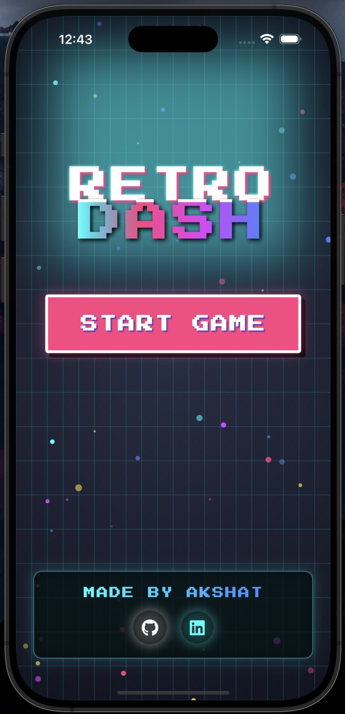

# RetroDash

**RetroDash** is a fast-paced, arcade-style shooter built with Flutter. Pilot your ship through waves of falling enemies, collect powerful upgrades, and unleash devastating nukes. Climb the leaderboard, challenge intense bosses, and survive as long as you can in this thrilling retro-inspired experience.

---

## Game Modes

###  Space Blasters Mode

* Auto-fire your way through waves of enemies.
* **Power-Up** every 100 points (starting at 50) — increases bullet firing rate.
* **Nuke** every 200 points — clears the screen of all enemies.
* **Boss Fight** every 500 points — test your skills against a challenging foe.

###  Manual Mode

* Full control of movement and shooting.
* Perfect for those who love an old-school challenge.

---

## Screenshots

Get a glimpse of the action before you play!

<p align="center">
  
  
</p>

---

## Features

*  **Dynamic Enemy Waves**
*  **Nuke Power-Ups**
*  **Stackable Fire Rate Boosts**
*  **Epic Boss Battles**
*  **Leaderboard System**
*  **Immersive Audio & Visuals**

---

## File Structure

```
RETRO_DASH/
├── android/
├── assets/
│   ├── audio/
│   ├── fonts/
│   ├── icon/
│   │   └── app_icon.png
│   └── images/
├── ios/
├── lib/
│   ├── widgets/
│   │   ├── build/
│   │   │   ├── animated_background.dart
│   │   │   ├── audio_player.dart
│   │   │   ├── homepage.dart
│   │   │   ├── personal_best.dart
│   │   │   ├── profile.dart
│   │   │   └── space_blaster.dart
│   └── main.dart
├── linux/
├── macos/
├── test/
├── web/
├── windows/
├── pubspec.yaml
└── README.md
```

---

##  Getting Started

### 1. Clone the Repository

```bash
git clone https://github.com/akshat2474/RetroDash
cd retrodash
```

### 2. Install Dependencies

```bash
flutter pub get
```

### 3. Run the Game

```bash
flutter run
```

---

## Contributing

We welcome contributions of all kinds—bug fixes, new features, performance improvements, and more.
To get started:

1. Fork the repo
2. Create a new branch
3. Make your changes
4. Open a Pull Request

---

## License

**MIT License**
See the [LICENSE](LICENSE) file for full details.
